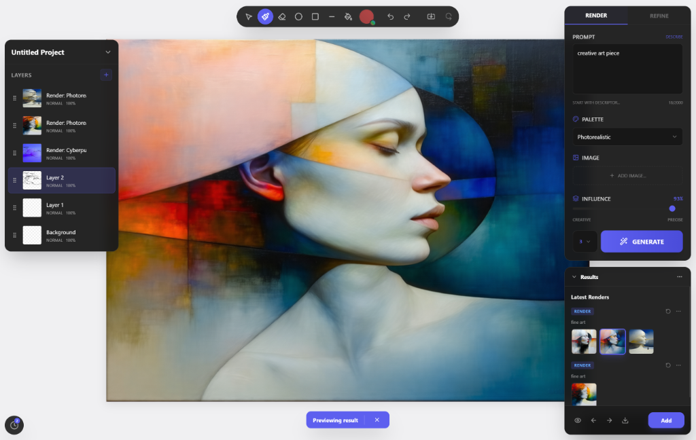

# OpenViz 🎨



OpenViz is an AI-powered design application that transforms hand-sketched drawings and imported images into photorealistic renders using advanced text-to-image models. Optimized for designers, architects, and product creators, OpenViz provides a fast, intuitive workflow to explore design iterations visually in seconds.

## ✨ Key Features

### 🖌️ Interactive Project Canvas
- **Konva-powered Engine:** Smooth, high-performance canvas interaction.
- **Drawing Tools:** Brush, Eraser, and Shape tools (Rectangles, Circles, Lines) with configurable properties.
- **Symmetry Mode:** Mirror your drawings vertically or horizontally for perfectly balanced designs.
- **Viewport Controls:** Smooth zoom (10% - 500%) and panning.

### 📑 Advanced Layer Management
- **Full Control:** Reorder, rename, hide, or delete layers.
- **Opacity & Blending:** Adjust layer transparency and blend modes (Normal, Multiply, Screen, Overlay).
- **Live Thumbnails:** Real-time visual feedback for every layer in the sidebar.
- **Type-specific Layers:** Support for sketch, image, and render layers.

### 🤖 AI-Powered Rendering
- **ComfyUI Integration:** Connect directly to your local ComfyUI instance for generation.
- **Prompt Engineering:** Multi-line prompt input with real-time character counting.
- **Style Presets:** Quickly switch between "Photorealistic", "Cyberpunk", "Watercolor", and more.
- **Influence Slider:** Control exactly how much the AI should follow your sketch vs. your prompt.
- **Batch Generation:** Generate multiple variations in one go.

### 🎨 Premium Design System
- **Modern Dark UI:** A sleek, glassmorphic interface designed for productivity.
- **Custom Color Picker:** Detailed color selection with HEX, HSL, and SV support.
- **Responsive Layout:** Optimized for desktop with a fluid, adaptive panel system.

---

## 🚦 Getting Started

### Prerequisites
- [Node.js](https://nodejs.org/) (v18+)
### ComfyUI Configuration

OpenViz uses ComfyUI as its background rendering engine. To ensure a smooth connection:

1.  **Launch ComfyUI** with the following flags to allow the Vite proxy to communicate with it:
    ```bash
    python main.py --listen --port 7821
    ```
    *(Note: If you use the default port 8188, update `targetUrl` in `vite.config.ts` accordingly).*

2.  **Required Models**: The default workflow expects the following models in your `ComfyUI/models` directory:
    - **Checkpoints**: `sd3.5_large_fp8_scaled.safetensors` (in `checkpoints/`)
    - **ControlNet**: `sd3.5_large_controlnet_canny.safetensors` (in `controlnet/`)

3.  **WSL Users**: If you are running OpenViz in WSL and ComfyUI on Windows:
    - The `vite.config.ts` is pre-configured to automatically find your Windows host IP.
    - Ensure your Windows Firewall allows inbound connections on the ComfyUI port (7821).

### Installation

1. **Clone the repository:**
   ```bash
   git clone https://github.com/Sander-HR/openviz.git
   cd openviz
   ```

2. **Install dependencies:**
   ```bash
   npm install
   ```

3. **Start the development server:**
   ```bash
   npm run dev
   ```

---

## 🛣️ Roadmap

### 🏁 Phase 1 (Current)
- [x] Basic canvas interaction and drawing tools.
- [x] Layer system with thumbnails and opacity.
- [x] ComfyUI integration for image generation.
- [x] Advanced color picker and theme refinement.

### 🏗️ Phase 2 (Imminent)
- [ ] **Refine Mode:** Iterative refinement of generated renders.
- [ ] **Import/Export:** Support for importing external images and exporting projects as PNG/JPG or `.openviz` JSON.
- [ ] **Shape Transformations:** Move, scale, and rotate objects after placement.
- [ ] **Workflow Presets:** Save and load custom ComfyUI workflows within the UI.

### 🚀 Phase 3 (Future)
- [ ] **Workbench** switch working on a larger canvas with multiple images and render modes.  
- [ ] **AI Prompt Generator:** Semi-automated prompt crafting based on sketch contents.
- [ ] **Mobile Optimization:** Touch-optimized UI for tablets and styluses.
- [ ] **Cloud Sync:** Cross-device project synchronization.

---

## 🛠️ Tech Stack

- **Framework:** React 18
- **State Management:** Zustand
- **Canvas Engine:** Konva.js
- **Styling:** Tailwind CSS + Lucide Icons
- **Build Tool:** Vite
- **AI Interface:** ComfyUI API (WebSocket/HTTP)

---

## 📄 License
This project is licensed under the MIT License - see the LICENSE file for details.
